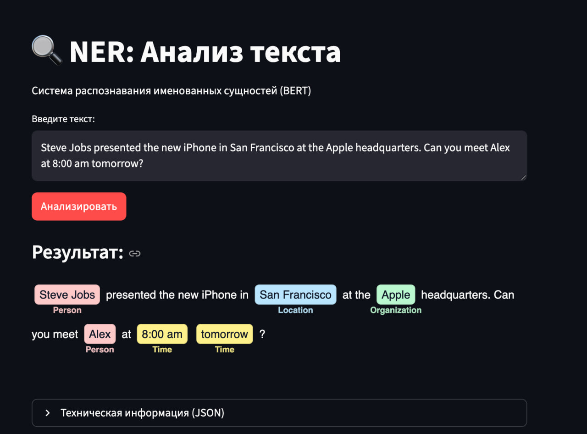

# BERT NER with Triton Inference Server

Этот проект реализует полный цикл MLOps для задачи Named Entity Recognition с использованием BERT: обучение, экспорт в ONNX или TensorRT, деплой через Triton Inference Server и UI на Streamlit.

## Постановка задачи

**Цель:** Разработка системы для автоматического анализа текста и выделения именованных сущностей (люди, географические локации, организации, временные метки и т.д.).

**Применение:** Автоматизация обработки документов, улучшение качества поиска и структурирование информации из новостных потоков. Ручная разметка данных неэффективна и дорога, поэтому требуется ML-решение.

### Формат данных

| | Описание |
|---|---|
| **Вход** | Строка текста на английском языке (предложение) |
| **Внутренний выход** | Логиты размерности `[batch_size, seq_len, num_labels]` |
| **Внешний вывод** | Отображение текста с семантической подсветкой сущностей |

## Пример работы системы


### Метрики

- **Основная метрика:** Micro F1-score (Entity-level) с использованием библиотеки `seqeval` (важно строгое совпадение целых сущностей, состоящих из нескольких слов)
- **Дополнительно:** Macro F1 для контроля качества на мелких классах
- **Почему не Accuracy:** Сильный дисбаланс классов — тег `O` (не сущность) занимает >80% токенов

**Ожидаемые значения F1-score:**
| Модель | F1-score |
|--------|----------|
| Бейзлайн (Bi-LSTM) | ~0.75–0.80 |
| Основная модель (BERT) | ~0.85–0.90 |

### Датасет

Используется **Annotated Corpus for Named Entity Recognition** (Groningen Meaning Bank) с [Kaggle](https://www.kaggle.com/datasets/abhinavwalia95/entity-annotated-corpus).

| Характеристика | Значение |
|----------------|----------|
| Объём | ~48k предложений, ~1.3M слов |
| Теги | 17 уникальных тегов (IOB-формат: B-geo, I-geo, B-per, O и т.д.) |
| Разделение | train/val/test: 80/10/10 |

**Особенности:**
- Дисбаланс классов: тег `O` доминирует, классы `art`, `eve`, `nat` представлены слабо (<0.1%)
- WordPiece токенизация BERT требует выравнивания меток (метка только первому саб-токену)

### Модель

**BERT-base-cased** с классификационной головой для token classification:
- 12 слоёв энкодера, hidden size 768, 12 attention heads
- Общее количество параметров: ~109M
- Cased-версия для различения регистра (Apple vs apple)
- Оптимизатор: AdamW, lr=3e-5
- Функция потерь: CrossEntropyLoss с ignore_index для паддинга

### Воспроизводимость

- `random_seed = 42` для всех библиотек (torch, numpy, random)
- Версионирование данных через **DVC**
- Логирование экспериментов через **WandB** и **MLflow**

---

## 1. Подготовка окружения

Для начала установите зависимости через Poetry и настройте Docker.

```bash
# Установка Python зависимостей
poetry install

# Активация окружения (опционально, команды ниже используют poetry run)
source $(poetry env info --path)/bin/activate
```

Для работы Triton Server на GPU убедитесь, что установлен [NVIDIA Container Toolkit](https://docs.nvidia.com/datacenter/cloud-native/container-toolkit/install-guide.html).

## 2. Обучение и экспорт модели

Все команды проекта доступны через единую точку входа `ner.commands`.

### 2.1. Обучение модели
```bash
# Запуск обучения (параметры конфигурируются в configs/config.yaml)
python -m ner.commands train

# С переопределением параметров Hydra
python -m ner.commands train trainer.max_epochs=5 model.lr=1e-5
```
Чекпоинт модели сохранится в папку `models/`.

### 2.2. Экспорт в ONNX
Скрипт автоматически найдет последний чекпоинт и сконвертирует его.
```bash
python -m ner.commands to-onnx
```
Это создаст файлы `model_repository/bert_ner_onnx/1/model.onnx` и `model_repository/bert_ner_onnx/1/model.onnx.data`.

### 2.3. Конвертация в TensorRT (опционально, только Linux + NVIDIA GPU)
Для максимальной производительности можно сконвертировать ONNX модель в TensorRT engine.
```bash
python -m ner.commands to-tensorrt
```
Это создаст файл `model_repository/bert_ner_tensorrt/1/model.plan`.

**Примечание:** TensorRT доступен только на Linux с NVIDIA GPU и требует установки CUDA и TensorRT SDK.

### 2.4. Локальный инференс
```bash
# Инференс с ONNX моделью
python -m ner.commands infer

# Инференс с TensorRT моделью
python -m ner.commands infer-tensorrt
```

## 3. Запуск Triton Inference Server

Для запуска сервера используется Docker. Убедитесь, что вы находитесь в корне проекта.

### Быстрый запуск через CLI

```bash
# GPU + ONNX модель (по умолчанию)
python -m ner.commands run-triton

# GPU + TensorRT модель
python -m ner.commands run-triton --model "tensorrt"

# CPU + ONNX модель
python -m ner.commands run-triton --device "cpu"

# Полный синтаксис
python -m ner.commands run-triton --device "gpu" --model "onnx"
python -m ner.commands run-triton --device "cpu" --model "onnx"
python -m ner.commands run-triton --device "gpu" --model "tensorrt"
```

**Примечание:** TensorRT модель требует GPU, поэтому `--device "gpu" --model "tensorrt"` вызовет ошибку.

### Ручной запуск Docker

**Команда запуска (GPU, все модели):**
```bash
docker run --gpus all --rm -p 8000:8000 -p 8001:8001 -p 8002:8002 \
  -v $(pwd)/model_repository:/models \
  nvcr.io/nvidia/tritonserver:24.05-py3 \
  tritonserver --model-repository=/models
```

**Только ONNX модель:**
```bash
docker run --gpus all --rm -p 8000:8000 -p 8001:8001 -p 8002:8002 \
  -v $(pwd)/model_repository:/models \
  nvcr.io/nvidia/tritonserver:24.05-py3 \
  tritonserver --model-repository=/models \
  --model-control-mode=explicit --load-model=bert_ner_onnx
```

**Только TensorRT модель:**
```bash
docker run --gpus all --rm -p 8000:8000 -p 8001:8001 -p 8002:8002 \
  -v $(pwd)/model_repository:/models \
  nvcr.io/nvidia/tritonserver:24.05-py3 \
  tritonserver --model-repository=/models \
  --model-control-mode=explicit --load-model=bert_ner_tensorrt
```

**Разбор команды:**
*   `--gpus all`: Использовать все доступные GPU.
*   `--rm`: Удалить контейнер после остановки.
*   `-p 8000:8000`: Проброс HTTP порта (для REST API).
*   `-p 8001:8001`: Проброс GRPC порта.
*   `-p 8002:8002`: Проброс порта метрик.
*   `-v $(pwd)/model_repository:/models`: Монтирование локальной папки `model_repository` внутрь контейнера в `/models`.
*   `nvcr.io/nvidia/tritonserver:24.05-py3`: Образ Docker (версия должна поддерживать версию Opset вашего ONNX файла).
*   `--model-control-mode=explicit`: Загружать только явно указанные модели.
*   `--load-model=<name>`: Имя модели для загрузки.

**Вариант запуска на CPU:**
Если GPU недоступен, просто уберите флаг `--gpus all`.

Дождитесь в логах сообщения: `Started HTTPService at 0.0.0.0:8000`.

## 4. Запуск UI приложения

В отдельном терминале запустите Streamlit приложение:

```bash
# Демо с Triton Inference Server
python -m ner.commands run-app

# Или локальное демо (без Triton)
python -m ner.commands demo-local
```

Приложение будет доступно по адресу: `http://localhost:8501`.

## Все доступные команды

Справка по всем командам:

```bash
python -m ner.commands --help
```

### `train` — Обучение модели

Запускает обучение BERT NER модели. Параметры конфигурируются в `configs/config.yaml` или передаются через Hydra overrides.

```bash
# Базовый запуск
python -m ner.commands train

# С переопределением параметров
python -m ner.commands train trainer.max_epochs=5 model.lr=1e-5
```

### `to-onnx` — Экспорт в ONNX формат

Конвертирует обученный чекпоинт (`.ckpt`) в ONNX формат для деплоя.

```bash
# Найдёт последний чекпоинт автоматически
python -m ner.commands to-onnx
```

### `to-tensorrt` — Конвертация в TensorRT

Конвертирует ONNX модель в TensorRT engine для максимальной производительности на NVIDIA GPU.

```bash
python -m ner.commands to-tensorrt
```

**Примечание:** Команда доступна только на Linux с установленным TensorRT SDK.

### `infer` — Локальный инференс (ONNX)

Тестовый запуск инференса на ONNX модели с примером текста.

```bash
python -m ner.commands infer
```

### `demo-local` — Локальное Streamlit демо

Запускает веб-интерфейс для NER с использованием локальной ONNX модели (без Triton).

```bash
python -m ner.commands demo-local
```

Приложение будет доступно по адресу: `http://localhost:8501`

### `run-app` — Streamlit демо с Triton

Запускает веб-интерфейс для NER с отправкой запросов на Triton Inference Server.

```bash
# Сначала запустите Triton Server, затем:
python -m ner.commands demo-triton
```

Приложение будет доступно по адресу: `http://localhost:8501`

---

| Команда | Описание |
|---------|----------|
| `train` | Обучение модели BERT NER |
| `to-onnx` | Экспорт чекпоинта в ONNX формат |
| `to-tensorrt` | Конвертация ONNX в TensorRT engine |
| `infer` | Тестовый инференс на ONNX модели |
| `demo-local` | Запуск локального Streamlit демо |
| `run-app` | Запуск Streamlit демо с Triton |
| `run-triton` | Запуск Triton Server (gpu/cpu, onnx/tensorrt) |

## Структура проекта

```
.
├── ner/                    # Основной пакет проекта
│   ├── __init__.py
│   ├── commands.py         # Единая точка входа для всех команд (CLI)
│   ├── dataset.py          # Загрузка и обработка данных
│   ├── model.py            # Модель BERT NER (PyTorch Lightning)
│   └── utils.py            # Вспомогательные функции
├── apps/                   # Streamlit приложения (UI)
│   ├── local_run.py        # Локальный инференс (ONNX Runtime)
│   └── triton_run.py       # Клиент для Triton Inference Server
├── scripts/                # Скрипты для запуска
│   ├── train.py            # Обучение модели
│   ├── to_onnx.py          # Экспорт в ONNX
│   ├── to_tensorrt.sh      # Конвертация в TensorRT
│   └── infer.py            # Инференс ONNX
├── configs/                # Конфигурации Hydra
│   ├── config.yaml         # Основной конфиг
│   ├── data/
│   │   └── gmb.yaml        # Параметры датасета
│   └── model/
│       └── bert_cased.yaml # Параметры модели
├── data/                   # Данные
│   ├── ner_dataset.csv     # Датасет GMB
│   ├── ner_dataset.csv.dvc # DVC-файл для версионирования
│   └── download.py         # Скрипт загрузки данных
├── models/                 # Артефакты обучения
│   ├── *.ckpt              # Чекпоинты PyTorch Lightning
│   └── tag2idx.pt          # Маппинг тегов
├── model_repository/       # Репозиторий для Triton Server (ВАЖНО ТУТ)
│   ├── bert_ner_onnx/      # Модель 1: ONNX
│   │    ├── 1/
│   │    │   └── model.onnx
│   │    └── config.pbtxt
│   └── bert_ner_tensorrt/  # Модель 2: TensorRT
│        ├── 1/
│        │   └── model.plan
│        └── config.pbtxt
├── plots/                  # Графики и визуализации
├── pyproject.toml          # Зависимости (Poetry)
└── poetry.lock
```
